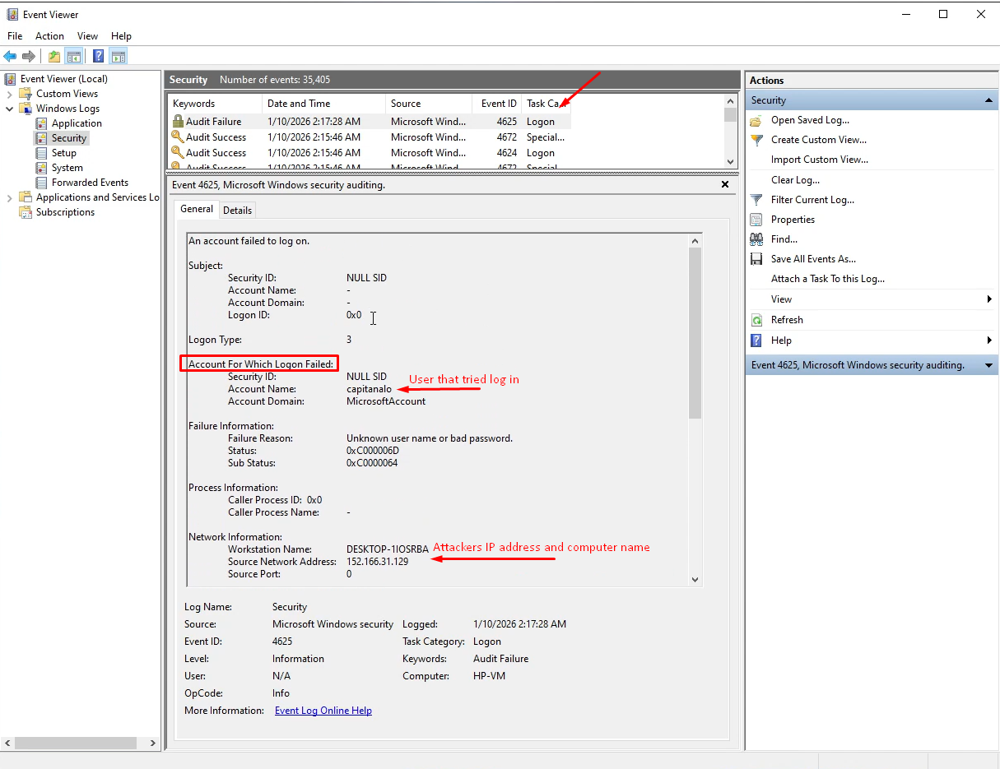
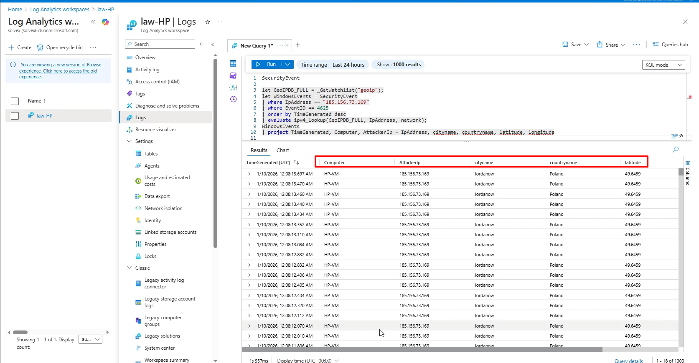

# Security Operation Center - HoneyPot 

## Overview

The purpose of this project is to design and deploy a cloud-based security monitoring environment that simulates real-world Security Operations Center (SOC) workflows. The lab focuses on building an end‑to‑end detection pipeline, from log generation and collection to enrichment, analysis, and visualization, using Microsoft Azure and Microsoft Sentinel.

## Architecture

This diagram shows the high-level architecture of the cloud SOC honeypot lab.

To start the lab, an Azure subscription was created and a Windows 10 virtual machine was deployed, configured as an intentionally exposed system. Network Security Group rules were adjusted to allow inbound traffic, and the Windows firewall was disabled, leaving the machine accessible from the Internet. Subsequently, failed login attempts were generated using a non-existent user to produce real security events on the system.

## Windows Logs
The Windows Event Viewer was then used to inspect the security logs, where events with Event ID 4625 were identified, corresponding to failed authentication attempts. These events are essential for security monitoring, as they allow the detection of suspicious activity such as unauthorized access attempts or brute-force attacks, confirming that the system is generating the telemetry needed for the next stages of the lab.

## Centralize local logs in the Azure cloud

To centralize the security logs, the Azure Monitor Agent (AMA) was installed on the Windows virtual machine to forward events to a Log Analytics Workspace in Azure. This workspace acts as a central repository for collecting and analyzing telemetry from multiple sources.

The Windows Security Events connector was configured to send authentication and system logs, including failed login attempts, from the VM to the workspace in real time. This setup enables querying, correlation, and visualization of security events in a centralized cloud platform, providing the foundation for further analysis and integration with Microsoft Sentinel.

## Visualizing Attacks via IP Geolocation

Finally, to visualize the origin of attacks, a Workbook in Microsoft Sentinel was created to map failed login attempts in a geographic format. A geolocation watchlist was imported to correlate each attacker IP address with its geographic location.

Using a Kusto Query Language (KQL) query, security events were combined with the watchlist data to generate a real-time attack map. This map allows visual identification of the regions from which intrusion attempts originate, helping detect attack patterns and providing a complete understanding of the cloud-based security monitoring and analysis workflow.

## Incident Analysis
A detailed walkthrough of the detected brute-force activity and recommended mitigations can be found [here](docs/incident_analysis.md).

## Results & Findings
- Observed real-world brute force attempts
- Identified attacker source countries via GeoIP
- Visualized attack patterns using Sentinel Workbooks

## Tools & Technology
- Azure Sentinel (Microsoft Sentinel)
- Log Analytics Workspace
- KQL (Kusto Query Language)
- GeoIP enrichment
- Azure VM / RDP logs
